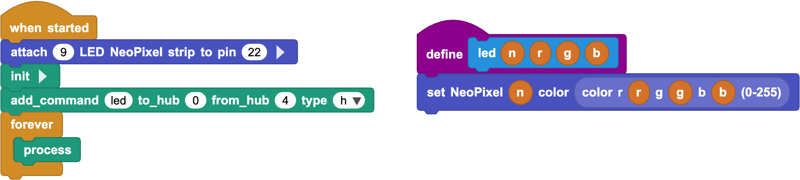

MicroPup documentation
=======================

MicroPup emulates the LEGO sensor protocol in MicroBlocks. 

Use this library to communicate from a MicroBlocks enabled board like LMS-ESP32 
as a Powered UP (PUP) Device with LEGO smart hubs. 
It has a PUPRemote library that acts more like RPC (Remote Procedure Calling).
The library is compatible with Pybricks, and SPIKE3 (with limitations).

Example
-------
Run this on LMS-ESP32 in MicroBlocks

Run this on Pybricks. 

.. literalinclude:: ../examples/neopixels/upup_neopixel.py
    :language: python

MicroPUP API documentation
---------------------------

.. automodule:: micropup
    :members:

